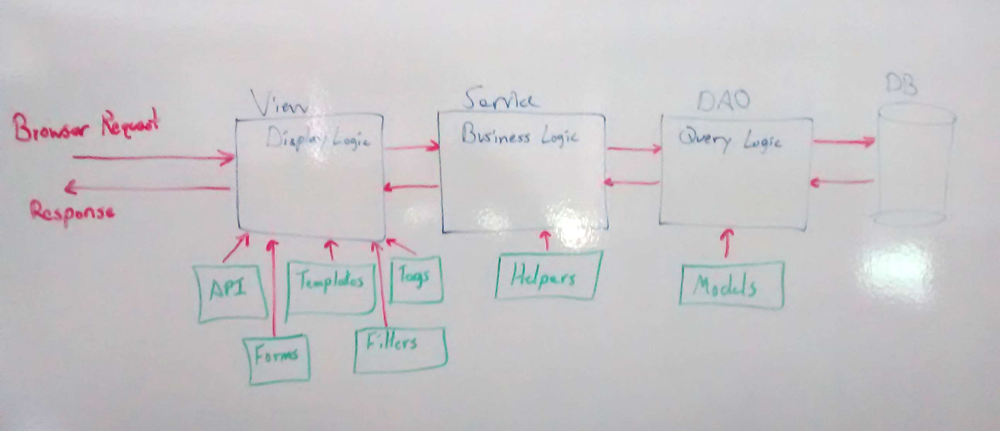

# PWI Architechual Documentation

## Basic Structure

### (API -> Service -> DAO -> Model -> DAO -> Service -> API) Design Pattern
The purpose of this pattern is to facilitate rapid development of frontend and backend programming in the pwi. Allowing multiple programmers to be working in the code at the same time without stepping on each other. There are multiple layers in order to keep responciblies of the code seperate as much as possiable.

### Views/API - pwi/pwi/views/api
API's will have four flavors of rest endpoints, create, read, update, delete, search.

- Create
   - /api/object - POST - Creates a new Object - Returns a JSON of the new Object
- Read
   - /api/object/key - GET - Retrieves the existing Object by database key - Returns a JSON of the Object
- Update
   - /api/object/key - PUT - Modifies the existing Object by database key - Returns a JSON of the modified Object
- Delete
   - /api/object/key - DELETE - Deletes the existing Object by database key - returns a json of succcess or fail with error message
- Search
   - /api/object/search - POST - Used to search for an object. Input is a JSON representation of object - Returns a JSON SearchResult object
   - /api/object/search?params=params - GET - Used to search for object by params passed in the URL - Returns a JSON Search Result object

All API's will return JSON, Create, Read, and Update will return the payload of the object or a error message. Delete will return a success or fail with message. And search will return a serialized SearchResults object.

### Service - mgipython/mgipython/service
The purpose of the service is to have a single location for business logic. The service does validation of objects before going to the backend. Also this is where any manipulation of objects happen before being sent to the view. Views will be the only caller to the service and the service should only communicate with a DAO, never the database directly. Services also should not do query logic in order to 
### DAO - mgipython/mgipython/dao
The DAO is where all the query logic gets placed, in order to retrieve objects from the database. This is also where the query gets put together for searching, based on query parameters from the SearchQuery object. Every DAO needs to extend the BaseDAO this gives every DAO the basic CRUD operations to the database. Base functions:
	
	BaseDAO:
	get_by_key(key)
	save(object)
	save_all(object[])
	delete(object)
	
	ModelDAO(BaseDAO):
	search(SearchQuery)
	
### Model - mgipython/mgipython/model
Models are SQLAlchemy models. They are organized by table prefix under a directory by the name of the DB schema. For instance the Marker model can be found in the mgd/mrk.py file, as well as all other models that belong to tables that start with mrk_. Every model needs to extend

	class Marker(db.Model, MGIModel):
	
This gives the model access to a query object and database, in order to communicate with the database.

### Views - pwi/pwi/views
In order to create a new directory for view. A blueprint file needs to be created in that directory and added to the view/\_\_init\_\_.py. Also when creating a new view in an existing view directory, the file needs to be imported by the blueprint.py that is located in the same directory. Views define the routes for the application and should only communicate with a service, never directly with a DAO or the database. Routes need to be unique across all views.

### Templates - pwi/pwi/templates
At the beginning of every template it needs to "extend" a base template. Generally speaking for our application that is pageLayout.html via

	
	
Once extended, the template will need to define a block called "content" and if the template needs to import any custom imports it will need to define a "imports" block. Each template can also set the "title" for each page from the inside.

### Forms - pwi/pwi/forms
These forms use a module called WTForms. This helps faciliate the creation of HTML forms on the webpage. These forms also help with dealing with form input data. A view will convert these forms to a SearchQuery object before doing searchs or a directory if the object needs to be saved.

### Tags (Template Tags) - pwi/pwi/templatetags
Template tags are used to generate small bits of html that can be reused across the whole site via different templates. Template accept certain variables to be setup a head of time, in order for them to work correctly.

### Filters - pwi/pwi/templatetags/filters
Filters are functions that have to be defined in the pwi/\_\_init__.py file. These help when displaying lists of info and generating HTML. They can be used by "piping" them together.

	{{marker.name | super | filter1 | filter2 | etc }}
	
In this example name will be automatically superscripted.
 
### Static HTML - pwi/pwi/static
This is the location where any static HTML, Javascript, css, images, etc, will be served from. If there is no view defined the server will look in this directory structure in order to find the request from the browser. Note all AngularJS and others javascripts will be served out of the mgijs product, so that this directory structure can stay clean.

### Helpers (Service Helpers) - mgipython/mgipython/service/helpers
This is the location of code that is used by the service to help in working with objects. One example would be to convert a complicated JSON input string into dictionaries that the DAO might be looking for in order to save complex objects.

### Exceptions - mgipython/mgipython/error
Errors.py is the file for defining custom exceptions. The following are defined:

	NotFoundError
	InvalidPermissionError
	InvalidStageInputError
	InvalidEMAPAIDError
	
These can be used anywhere in the code and the Views are configured to capture these errors, and give the correct error messaging.

## Searching and Querying (SearchQuery / SearchResults Pattern)

### Search Query
When searching the View will create a new SearchQuery Object and load it up with the search params coming from a query form or JSON string and convert them to the params field in the SearchQuery object this is then passed to the Service in order to search for specific objects. The View will also if needed add a Pageination Object, to the SearchQuery if it needs to display the results in paged form. The Service will do any validation, before sending it onto the DAO, or multiple DAO's.

### Search Results
Once a DAO recieves a SearchQuery it will run build the query based on the params field, and then run the query. The results will be repackaged into a SearchResults object to return the payload of the query. It will also attach to the SearchResults the Pagenation Object that came in from the SearchQuery object. Before returning the results object to the service. This is all handled in the base DAO class so no pagenation specific queries need to be done. All the DAO needs to do is implement the search method and build the correct query.

## CRUD

### Creating new objects
When creating a new object to be saved to the database. The View should take all the incoming params either via JSON object or WTFrom and convert them into a dictionary before calling the "create" method on the service. The "create" method on the service is used to add the new object to the database. The Service will verify that all the params that are required are set. Then the service will create a new model object copy all the fields needed for creation, and then proceed on to call the DAO's "create" method passing in the new model. The DAO will not verify anything other then trying to get the object created in the database and report any errors in doing so.

### Reading objects
The View should call the getObjectByCriteria(criteria) on the Service. The Service will then use the correct DAO to get the data from the database and format it accordingly, for the view to use the data. Typically this is the getObjectByKey method.

### Updating objects
When updating an object to the database. The view should take the input params coming from the request either the JSON or WTForm and turn them into a dictionary and then call the update method on the service passing it a dictionary. The View should call the "save" method on the service to save the object to the database. The Service will verify that all the params that are required are set, then the service will do a lookup to the database in order to get the corrisponding model. It will then copy all the fields from the dictionary, that the view is allows to modify, to the model, then proceed on to call the DAO's "save" method passing in the modified model. The DAO will not verify anything other then trying to get the object saved to the database and report any errors in doing so.

### Deleting objects
The view will call the services "delete" function with a key or some other identifier for the object. The service will do a lookup of the model to make sure it exists, and then call the DAO's delete method in order to delete the record from the database. The response to the view will only be a success or fail.
